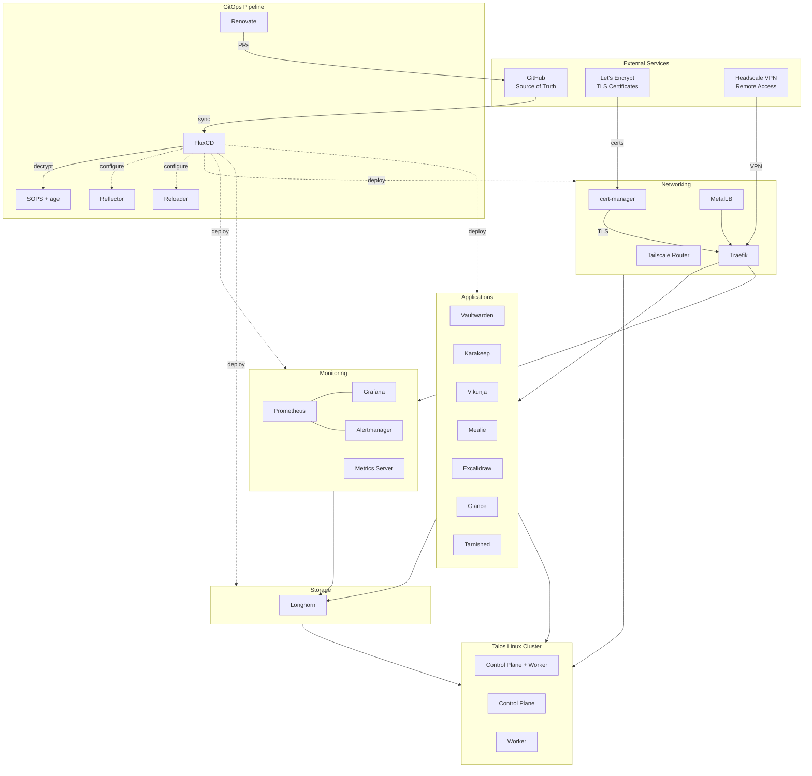

# Homelab Infrastructure

**Enterprise-grade Kubernetes homelab deployed via GitOps on Talos Linux.**

## Executive Summary

This repository contains my complete infrastructure-as-code setup for a production-grade Kubernetes homelab. I am running Talos Linux and managing everything through GitOps with FluxCD. The project shows how to apply real cloud-native patterns at home, including multi-tier deployment automation, encrypted secrets, distributed storage, and full observability.

The entire cluster follows GitOps principles. All infrastructure and application state lives in YAML, and FluxCD keeps everything in sync automatically. When I push changes to GitHub, Flux reconciles the cluster within minutes. This means safe, trackable infrastructure changes with built-in drift detection and rollback capability.

I chose Talos Linux for its immutable, minimal design. The setup runs distributed block storage with replication (Longhorn), handles TLS certificates automatically through DNS-01 challenges (cert-manager), load-balances ingress with MetalLB and Traefik, and monitors everything with kube-prometheus-stack. All secrets are encrypted at rest using SOPS and age.

## System Architecture

## Writing

I write about my homelab architecture and decisions on my blog. These posts provide deeper context on the design choices and implementation details.

- [Installing Talos Linux](https://markonakic.xyz/posts/talos-install/) - Complete walkthrough of setting up Talos Linux from scratch
- [Remote Access Architecture of My Kubernetes Homelab](https://markonakic.xyz/posts/remote-access/) - How I use Headscale for secure remote access to self-hosted services
